# Claude Adapter Python 版

[](https://opensource.org/licenses/MIT)
[](https://www.python.org/downloads/)

[English](README.md) | 中文

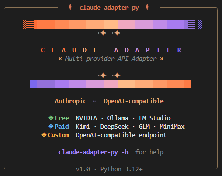
---

## 概述

Claude Adapter Python 是一个本地 HTTP 代理服务器，让你能够在 [**Claude Code**](https://github.com/anthropics/claude-code) 中使用 **OpenAI 兼容的 API**。

通过将 Anthropic Messages API 请求转换为 OpenAI Chat Completions 格式，可以：

- 使用任何 OpenAI 兼容 API 与 Claude Code 配合
- 轻松切换不同的 AI 提供商（免费：NVIDIA、Ollama、LM Studio；付费：Kimi、DeepSeek、Z.ai、MiniMax；自定义端点）
- 使用 Ollama 或 LM Studio 运行本地模型
- 完整的工具调用支持，原生和 XML 两种模式
- 流式响应，实时交互

## 支持的提供商

| 分类 | 提供商 | 类型 | 说明 |
|------|--------|------|------|
| **免费** | NVIDIA NIM | 云端 API | https://build.nvidia.com |
| **免费** | Ollama | 本地 + 云端 | https://ollama.com，支持本地和云端模型 |
| **免费** | LM Studio | 仅本地 | https://lmstudio.ai，仅支持本地模型 |
| **付费** | Kimi | 云端 API | https://platform.moonshot.cn |
| **付费** | DeepSeek | 云端 API | https://platform.deepseek.com |
| **付费** | GLM Z.ai | 云端 API | https://bigmodel.cn |
| **付费** | MiniMax | 云端 API | https://platform.minimaxi.com |
| **自定义** | OpenAI-compatible | 任意 | 任意兼容 OpenAI 的端点 |

## 安装

```bash
# 从源码安装
git clone <repo-url>
cd claude-adapter-py
pip install -e .

# 或从 PyPI 安装（发布后）
pip install claude-adapter-py
```

## 快速开始

### 1. 运行适配器

```bash
claude-adapter-py
```

### 2. 选择提供商类型

运行后首先进入提供商选择，会看到三个分类及导航选项：

```
? Choose provider type 选择提供商类型:
  Free    NVIDIA, Ollama, LM Studio
  Paid    Kimi, DeepSeek, GLM, MiniMax
  Custom  OpenAI-compatible endpoint
  Go back  返回重新选择
  Exit  退出
```

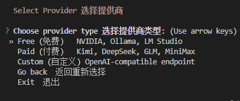

### 3. 选择具体提供商

选择分类后，选择具体提供商（每个菜单也都有 **Go back** 和 **Exit**）：

```
? Choose provider 选择提供商:
  NVIDIA NIM              NVIDIA NIM API (https://build.nvidia.com/)
  Ollama                  Ollama localhost:11434 (https://ollama.com/)
  LM Studio               LM Studio localhost:1234 (https://lmstudio.ai/)
  Go back  返回重新选择
  Exit  退出
```

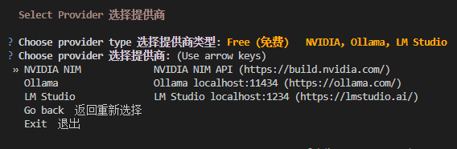

### 4. 使用已存储配置 或 配置参数

**如果已有该提供商的存储配置**：

```
? NVIDIA NIM found, choose action 已有配置，选择操作:
  Use saved config  使用已存储的 NVIDIA NIM 配置启动
  Reconfigure  重新配置 NVIDIA NIM 参数
  Go back  返回重新选择
  Exit  退出
```

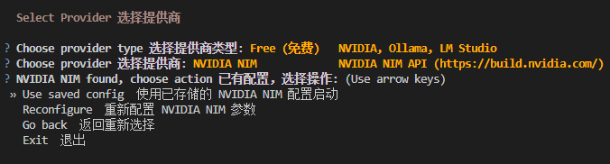

**如果没有存储配置**：

```
? No config for Ollama, choose action 无已存储配置，选择操作:
  Configure  配置 Ollama 参数
  Go back  返回重新选择
  Exit  退出
```

每一步（包括引导确认、工具格式选择等）都提供 **Go back** 返回上一步和 **Exit** 退出。

### 5. 适配器将会

- 显示所选提供商的操作引导
- 引导你逐步输入 API Key、Base URL、端口、模型映射、工具格式
- 保存配置，下次直接使用
- 在 `http://localhost:3080` 启动 HTTP 服务器
- 自动更新 `~/.claude/settings.json`

### 6. 正常使用 Claude Code

所有请求都会通过适配器路由。

```bash
# 复制此命令设置环境变量：
export ANTHROPIC_BASE_URL="http://localhost:3080"
```

---

## 各提供商配置指南

### NVIDIA NIM  免费，云端

1. 访问 https://build.nvidia.com 注册账号
2. 获取 API Key，格式：`nvapi-xxxx`
3. 选择模型，推荐：`minimaxai/minimax-m2.1`
4. 配置完成后即可使用

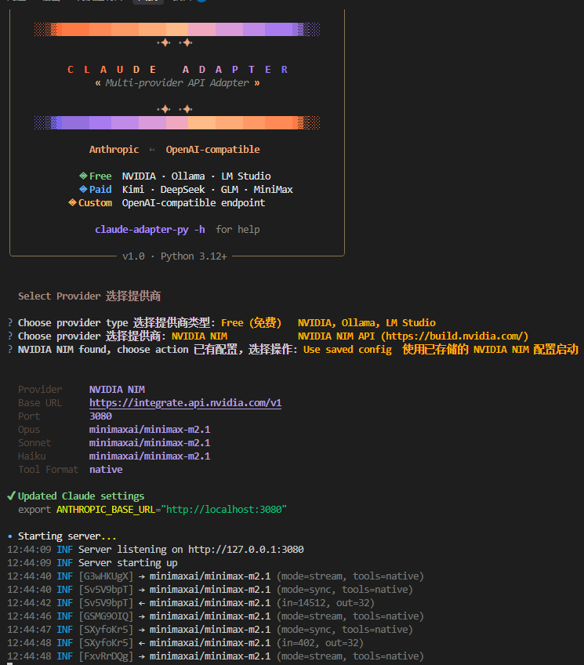
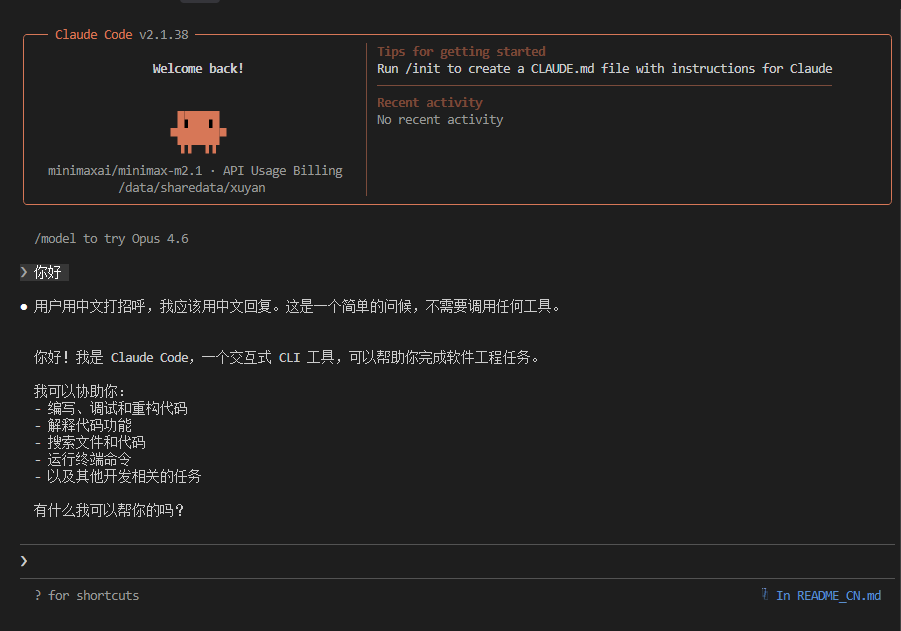
### Ollama  免费，本地 + 云端

Ollama 同时支持**本地模型**和**云端模型**。

```bash
# 1. 安装 Ollama
curl -fsSL https://ollama.com/install.sh | sh

# 2. 启动服务
ollama serve

# 3. 拉取本地模型
ollama pull gpt-oss:20b

# 3b. 或拉取云端模型
ollama pull kimi-k2.5:cloud

# 4. 查看已有模型
ollama list
```

> 启动适配器前，请确保 `ollama serve` 正在运行。

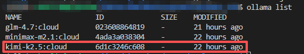

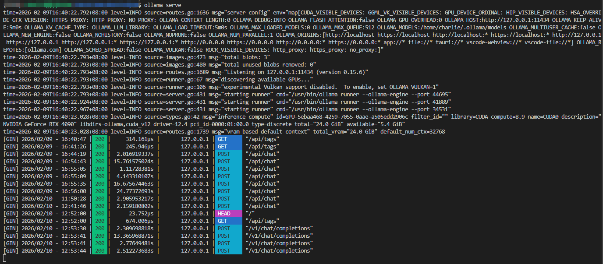

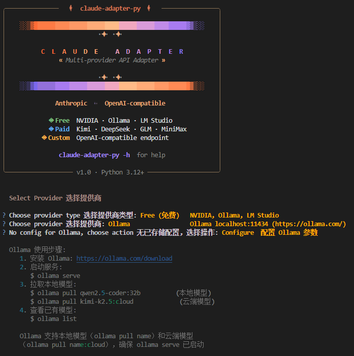

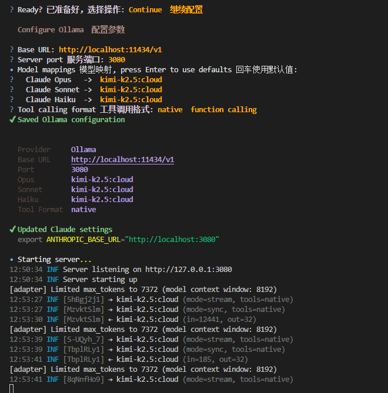

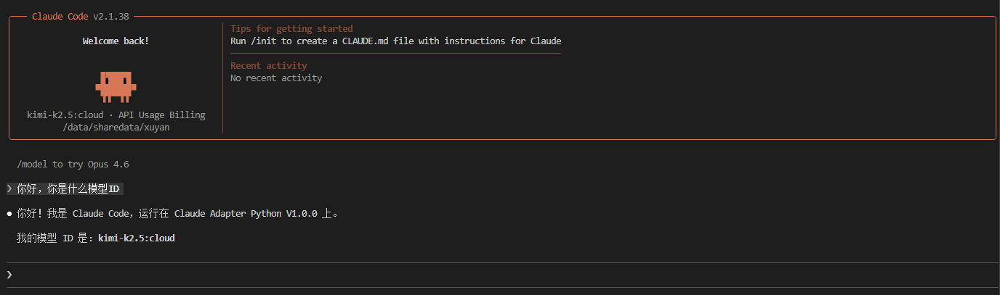

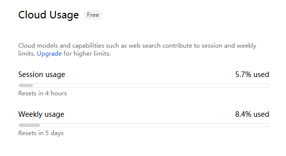
### LM Studio  免费，仅本地

LM Studio **仅支持本地模型**，使用前需要下载、加载、启动服务。

```bash
# 1. 下载 LM Studio
#    访问 https://lmstudio.ai

# 2. 搜索并下载模型
lms get <model-name>

# 3. 加载模型到内存
lms load <model-name>

# 4. 启动服务
lms server start
```

> 默认端口 1234。建议在 LM Studio 设置中将 Context Length 调至 16384+。

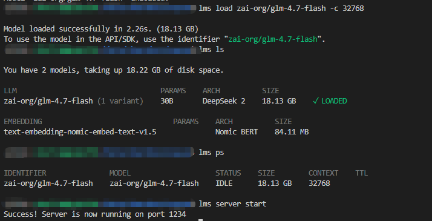

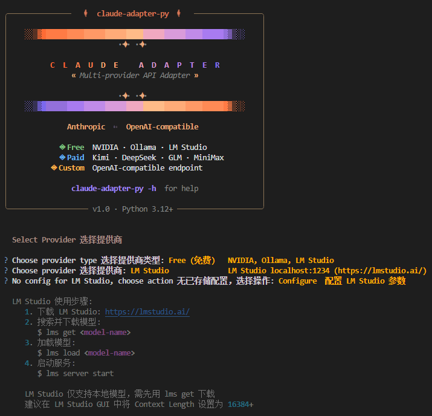

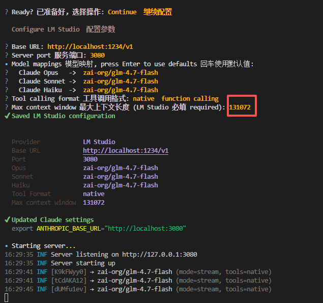

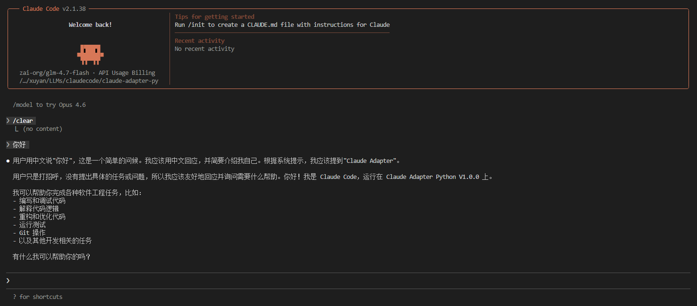

### Kimi  付费，云端

1. 访问 https://platform.moonshot.cn/console/api-keys
2. 注册账号并创建 API Key，格式：`sk-xxxx`
3. 推荐模型：`kimi-k2.5`

### DeepSeek  付费，云端

1. 访问 https://platform.deepseek.com/api_keys
2. 注册账号并创建 API Key，格式：`sk-xxxx`
3. 推荐模型：`deepseek-chat`

### Z.ai  付费，云端

1. 访问 https://bigmodel.cn/usercenter/proj-mgmt/apikeys
2. 注册账号并创建 API Key，格式：`xxxx.xxxx`
3. 推荐模型：`glm-4.7`

### MiniMax  付费，云端

1. 访问 https://platform.minimaxi.com/user-center/basic-information/interface-key
2. 注册账号并创建 API Key，格式：`eyxxxx`
3. 推荐模型：`MiniMax-M2.1`

### 自定义 OpenAI-compatible

1. 准备好任意兼容 OpenAI API 的服务端点
2. 输入 Base URL，如 `https://api.openai.com/v1`
3. 输入 API Key
4. 输入模型名称

---

## CLI 命令

```bash
# 启动服务器（交互式：先选提供商，再选使用配置 / 重新配置 / 配置参数）
claude-adapter-py

# 强制重新配置当前提供商
claude-adapter-py -r

# 自定义端口
claude-adapter-py -p 8080

# 跳过 Claude 设置更新
claude-adapter-py --no-claude-settings

# 列出已保存的提供商
claude-adapter-py ls

# 删除提供商配置（确认时也有 Go back / Exit）
claude-adapter-py rm <provider-name>

# 查看帮助
claude-adapter-py -h
```

每个交互菜单都可选择 **Go back** 返回上一步或 **Exit** 退出。

## 配置文件

所有配置存储在 `~/.claude-adapter/`：

```
~/.claude-adapter/
├── settings.json           # 活跃提供商
├── metadata.json           # 用户元数据
├── providers/              # 各提供商配置
│   ├── nvidia.json
│   ├── ollama.json
│   └── ...
├── token_usage/            # 每日 Token 使用日志
│   └── 2026-02-10.jsonl
└── error_logs/             # 错误日志
    └── 2026-02-10.jsonl
```

### 配置示例

```json
{
  "provider": "ollama",
  "base_url": "http://localhost:11434/v1",
  "api_key": "ollama",
  "models": {
    "opus": "qwen2.5-coder:32b",
    "sonnet": "qwen2.5-coder:14b",
    "haiku": "qwen2.5-coder:7b"
  },
  "tool_format": "native",
  "port": 3080,
  "max_context_window": 8192
}
```

## 架构

```
Claude Code  ->  Anthropic API 请求
                     |
              Claude Adapter  localhost:3080
                     |
              转换为 OpenAI 格式
                     |
              OpenAI 兼容 API  NVIDIA, Ollama 等
                     |
              转换回 Anthropic 格式
                     |
              Claude Code  接收响应
```

## 工具调用模式

### 原生模式  推荐用于云端 API

使用 OpenAI 原生 function calling。适用于 NVIDIA、Kimi、DeepSeek、GLM、MiniMax 等云端提供商。

### XML 模式  推荐用于本地模型

将 XML 工具指令注入系统提示。模型输出 `<tool_code>` XML 标签。适用于没有原生 function calling 支持的本地模型。

## 故障排除

### 端口被占用

适配器会自动查找下一个可用端口，或手动指定：

```bash
# 查询并结束占用端口
lsof -i :3080
kill -9 <id>
# 或，换端口
claude-adapter-py -p 8080
```

### LM Studio 或 Ollama 上下文窗口错误

- 在 LM Studio GUI 中将上下文长度增加到 16384+
- 或编辑 `~/.claude-adapter/providers/lmstudio.json`，设置 `"max_context_window": 32768`

### API 密钥问题

```bash
claude-adapter-py -r
```

### 模型找不到

**Ollama**：运行 `ollama list` 查看已有模型，`ollama pull <model>` 拉取模型

**LM Studio**：确保已用 `lms load <model>` 加载模型，且服务已用 `lms server start` 启动


## 项目结构

```
claude-adapter-py/
├── src/claude_adapter/
│   ├── __init__.py         # 包初始化
│   ├── __main__.py         # 入口点
│   ├── cli.py              # CLI 实现
│   ├── server.py           # FastAPI 服务器
│   ├── providers.py        # 提供商预设和分类
│   ├── models/             # Pydantic 数据模型
│   ├── converters/         # 协议转换器
│   ├── handlers/           # API 处理器
│   └── utils/              # 工具函数
├── pyproject.toml
├── README.md
└── README_CN.md
```

## 许可证

MIT 许可证

## 致谢

基于 TypeScript [claude-adapter](https://github.com/shantoislamdev/claude-adapter) 的 Python 完全重写版本，增强了多提供商支持、交互式 CLI 和改进的架构。
